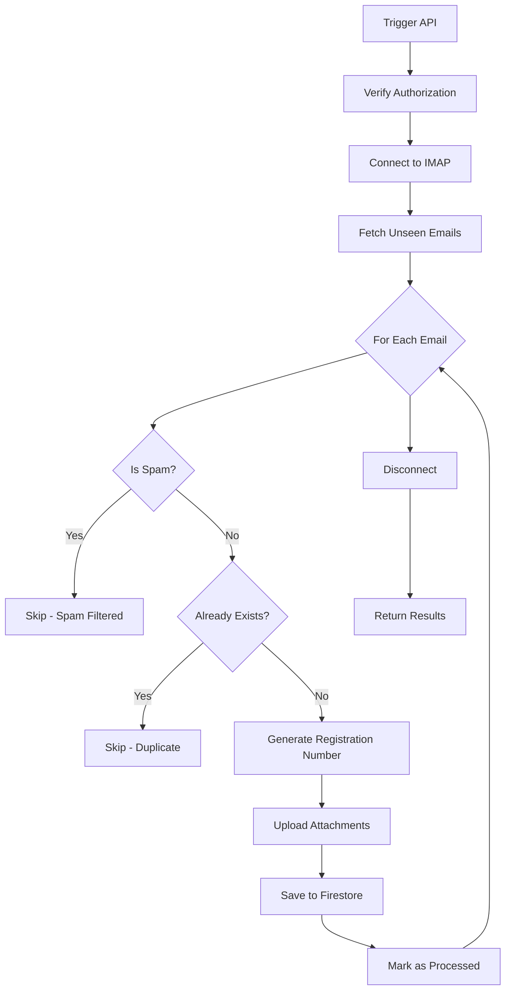

# Fetch Emails API - Implementation Guide

## Overview

The `/api/fetch-emails` endpoint connects to an IMAP inbox, fetches unseen emails, filters spam, and saves legitimate emails to the Firestore `registratura_emails` collection with unique registration numbers.

## Installation

### Required Package

You need to install the `imapflow` library to replace the old `imap` library:

```bash
npm install imapflow
```

### Optional: Remove Old Library

```bash
npm uninstall imap @types/imap
```

## Features Implemented

### ✅ 1. IMAP Connection with imapflow
- Modern, promise-based IMAP client
- Better error handling and performance
- Supports both secure (TLS) and non-secure connections

### ✅ 2. Email Fetching
- Fetches unseen emails from the last 24 hours
- Extracts: `messageId`, `from`, `to`, `subject`, `body` (text & HTML), `attachments`
- Marks emails as seen after processing

### ✅ 3. Spam Filter
**Location**: `lib/email-service.ts` - `isSpam()` function

**Detection Methods**:
- **Keyword Matching**: Checks for common spam words (promo, discount, free, etc.)
- **Phrase Detection**: Identifies spam phrases in both English and Romanian
- **Capitalization Analysis**: Flags emails with excessive caps (>50%)
- **Exclamation Marks**: Flags emails with 3+ exclamation marks

**Configurable Keywords**:
```typescript
// English spam keywords
'promo', 'promotion', 'discount', 'sale', 'offer', 'deal', 'free',
'win', 'winner', 'prize', 'lottery', 'congratulations'

// Romanian spam keywords
'reducere', 'oferta', 'gratuit', 'castiga', 'premiu',
'abonament', 'dezaboneaza', 'promovare'
```

### ✅ 4. Duplicate Prevention
- Checks `messageId` before saving
- Skips emails already in Firestore

### ✅ 5. Registration Number Generator
**Format**: `REG-YYYY-NNNNNN`
- Example: `REG-2025-000123`
- Year-based counter with automatic reset
- Transaction-based to prevent duplicates
- Zero-padded 6-digit sequential number

### ✅ 6. Firestore Structure
Collection: `registratura_emails`

**Document Fields**:
```typescript
{
  id: string;                    // Auto-generated Firestore ID
  messageId: string;             // Email message ID (for deduplication)
  numarInregistrare: string;     // Registration number (REG-YYYY-NNNNNN)
  from: string;                  // Sender email
  to?: string;                   // Recipient email
  subject: string;               // Email subject
  body: string;                  // Plain text body
  bodyHtml?: string;             // HTML body
  dateReceived: Timestamp;       // Email received date
  attachments: Array<{           // Uploaded attachments
    url: string;
    name: string;
    size: number;
    type: string;
  }>;
  status: EmailStatus;           // 'nou' | 'in_lucru' | 'rezolvat' | 'respins'
  observatii?: string;           // Admin notes
  assignedTo?: string;           // Assigned admin user
  createdAt: Timestamp;          // Record creation timestamp
  updatedAt: Timestamp;          // Last update timestamp
}
```

### ✅ 7. Attachment Handling
- Uploads attachments to Firebase Storage
- Path: `registratura/{registrationNumber}/{filename}`
- Sanitizes filenames (removes special characters)
- Returns downloadable URLs

### ✅ 8. Security & Authentication

**Multi-layer Authorization**:
1. **Vercel Cron Jobs**: Automatic verification via `x-vercel-cron` header
2. **Cron Secret**: Bearer token authentication for scheduled tasks
3. **Admin Authentication**: Firebase Admin SDK integration (extensible)

**GET Endpoint** (Automatic/Scheduled):
- Accepts Vercel Cron requests
- Accepts requests with valid `CRON_SECRET`

**POST Endpoint** (Manual Trigger):
- Requires admin authentication
- Can be extended with Firebase Auth token verification

**HEAD Endpoint** (Health Check):
- Verifies environment variable configuration
- Returns 200 if configured, 503 if missing variables

## Environment Variables

Required in `.env.local`:

```bash
# Email/IMAP Configuration
EMAIL_HOST=imap.your-provider.com
EMAIL_PORT=993
EMAIL_USER=your-email@example.com
EMAIL_PASSWORD=your-password
EMAIL_TLS=true

# Security (optional but recommended)
CRON_SECRET=your-secret-key-here

# Firebase (already configured in your project)
NEXT_PUBLIC_FIREBASE_API_KEY=...
FIREBASE_PROJECT_ID=...
FIREBASE_CLIENT_EMAIL=...
FIREBASE_PRIVATE_KEY=...
```

## API Usage

### 1. Manual Trigger (POST)

```bash
curl -X POST http://localhost:9002/api/fetch-emails \
  -H "Authorization: Bearer your-admin-token"
```

### 2. Scheduled Cron (GET)

Configure in `vercel.json`:
```json
{
  "crons": [{
    "path": "/api/fetch-emails",
    "schedule": "0 */4 * * *"
  }]
}
```

### 3. Health Check (HEAD)

```bash
curl -I http://localhost:9002/api/fetch-emails
```

## Response Format

### Success Response
```json
{
  "success": true,
  "message": "Processed 5 emails successfully",
  "processed": 5,
  "skipped": 2,
  "spamFiltered": 3,
  "totalFound": 10,
  "errors": [],
  "timestamp": "2025-10-19T10:30:00.000Z"
}
```

### Error Response
```json
{
  "success": false,
  "error": "Connection timeout",
  "timestamp": "2025-10-19T10:30:00.000Z"
}
```

## Workflow



## Customization

### Adjust Spam Filter Sensitivity

Edit `lib/email-service.ts`:

```typescript
// Make it more strict (fewer false negatives)
if (keywordMatches >= 2 || phraseMatches >= 1) {
  return true;
}

// Make it more lenient (fewer false positives)
if (keywordMatches >= 5 || phraseMatches >= 3) {
  return true;
}
```

### Add Custom Spam Keywords

```typescript
const CUSTOM_SPAM_KEYWORDS = [
  'your-custom-word',
  'another-spam-word',
];

const SPAM_KEYWORDS = [
  ...CUSTOM_SPAM_KEYWORDS,
  // ... existing keywords
];
```

### Change Registration Number Format

Edit `lib/registratura-service.ts`:

```typescript
// Example: DOC-2025-0123 (4 digits instead of 6)
const paddedNumber = String(nextNumber).padStart(4, '0');
return `DOC-${currentYear}-${paddedNumber}`;
```

## Testing

### Test Spam Filter

```typescript
import { isSpam } from '@/lib/email-service';

console.log(isSpam('FREE DISCOUNT NOW!!!', 'Click here to win')); // true
console.log(isSpam('Invoice for Services', 'Please find attached')); // false
```

### Test Locally

1. Start dev server: `npm run dev`
2. Trigger endpoint: `curl -X POST http://localhost:9002/api/fetch-emails`
3. Check Firestore for new documents

## Troubleshooting

### Connection Issues

```bash
# Test IMAP connection
node -e "
const { ImapFlow } = require('imapflow');
const client = new ImapFlow({
  host: 'your-host',
  port: 993,
  secure: true,
  auth: { user: 'user', pass: 'pass' }
});
client.connect().then(() => console.log('OK'));
"
```

### Environment Variables Not Loading

- Ensure `.env.local` is in project root
- Restart Next.js dev server
- Check for typos in variable names

### Firebase Permissions

- Verify Firebase Storage rules allow uploads to `registratura/` path
- Check Firestore rules allow reads/writes to `registratura_emails` collection

## Architecture References

- **CLAUDE.md**: Project architecture documentation
- **lib/firebase.ts**: Firebase client configuration
- **lib/firebase-admin.ts**: Firebase Admin SDK setup
- **types/registratura.ts**: TypeScript type definitions

## Support

For issues or questions:
1. Check console logs with `[FETCH-EMAILS]` prefix
2. Verify environment variables are set correctly
3. Test IMAP connection independently
4. Review Firebase Storage and Firestore permissions
