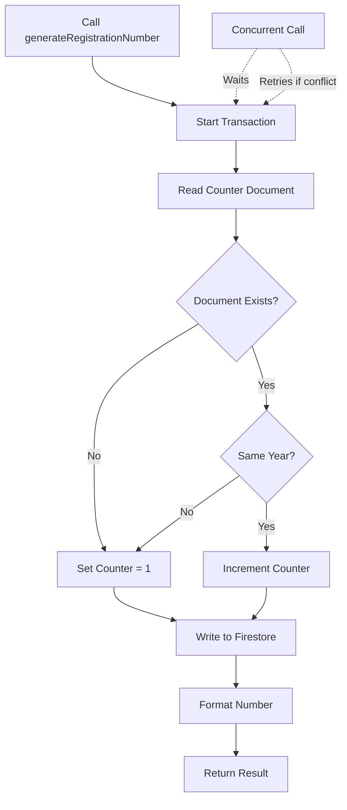

# Registration Number Generator

A thread-safe, reusable utility for generating unique sequential registration numbers for the electronic registry (registratură) system.

## 📦 Installation

The utility is already included in the project at:
```
lib/generateRegistrationNumber.ts
```

No additional packages required - uses existing Firestore dependencies.

## 🎯 Features

✅ **Thread-Safe**: Uses Firestore transactions for concurrency safety
✅ **Year-Based Counter**: Automatic reset on new year
✅ **Customizable**: Configure prefix, padding, and year
✅ **Retry Logic**: Built-in retry mechanism for transient failures
✅ **Error Handling**: Comprehensive error messages and validation
✅ **Monitoring**: Helper functions to preview and check counter state
✅ **Zero Dependencies**: Uses existing Firebase setup

## 🚀 Quick Start

### Basic Usage

```typescript
import { generateRegistrationNumber } from '@/lib/generateRegistrationNumber';

// Generate a standard registration number
const regNumber = await generateRegistrationNumber();
console.log(regNumber); // "REG-2025-000001"
```

### With Options

```typescript
// Custom prefix
const docNumber = await generateRegistrationNumber({
  prefix: 'DOC',
});
// Output: "DOC-2025-000001"

// Custom padding
const shortNumber = await generateRegistrationNumber({
  padding: 4,
});
// Output: "REG-2025-0001"

// Combined options
const customNumber = await generateRegistrationNumber({
  prefix: 'INV',
  padding: 5,
  year: 2025,
});
// Output: "INV-2025-00001"
```

## 📝 API Reference

### `generateRegistrationNumber(options?)`

Main function to generate a unique registration number.

**Parameters:**
```typescript
interface GenerateOptions {
  prefix?: string;   // Default: "REG"
  padding?: number;  // Default: 6 (produces 000001)
  year?: number;     // Default: current year
}
```

**Returns:** `Promise<string>`

**Throws:**
- `ValidationError` - Invalid options or counter overflow
- `Error` - Transaction failures or database issues

**Example:**
```typescript
const regNum = await generateRegistrationNumber({
  prefix: 'ORDER',
  padding: 5,
  year: 2025,
});
// Returns: "ORDER-2025-00001"
```

---

### `getCurrentCounter()`

Retrieves the current counter state without incrementing it.

**Returns:** `Promise<RegistraturaCounter | null>`

**Example:**
```typescript
const counter = await getCurrentCounter();
if (counter) {
  console.log(`Year: ${counter.year}, Last: ${counter.lastNumber}`);
}
```

---

### `previewNextNumber(options?)`

Preview what the next registration number will be without generating it.

**Parameters:** Same as `generateRegistrationNumber`

**Returns:** `Promise<string>`

**Example:**
```typescript
const preview = await previewNextNumber();
console.log('Next number will be:', preview);
// "REG-2025-000123"
```

---

### `resetCounter(year?, startNumber?)`

⚠️ **WARNING:** Resets the counter. Use with extreme caution!

**Parameters:**
- `year?: number` - Year to reset (default: current year)
- `startNumber?: number` - Starting number (default: 0)

**Returns:** `Promise<void>`

**Example:**
```typescript
// Reset to start from 1
await resetCounter();

// Reset to specific number
await resetCounter(2025, 1000);
```

## 🔧 Integration Guide

### In Fetch Emails API

```typescript
// app/api/fetch-emails/route.ts
import { generateRegistrationNumber } from '@/lib/generateRegistrationNumber';

export async function GET(request: NextRequest) {
  // ... email fetching logic

  for (const email of newEmails) {
    // Generate unique registration number
    const regNumber = await generateRegistrationNumber();

    // Save to Firestore
    await saveEmail({
      numarInregistrare: regNumber,
      from: email.from,
      subject: email.subject,
      // ... other fields
    });
  }
}
```

### In Registratura Service

Already integrated! The `RegistraturaService` now uses this utility:

```typescript
// lib/registratura-service.ts
import { generateRegistrationNumber } from '@/lib/generateRegistrationNumber';

export class RegistraturaService {
  async generateRegistrationNumber(): Promise<string> {
    return generateRegistrationNumber();
  }

  // ... rest of the service
}
```

### In Manual Registration Form

```typescript
// components/ManualRegistrationForm.tsx
import { generateRegistrationNumber, previewNextNumber } from '@/lib/generateRegistrationNumber';

function ManualRegistrationForm() {
  const [previewNumber, setPreviewNumber] = useState<string>('');

  useEffect(() => {
    // Show user what number they'll get
    previewNextNumber().then(setPreviewNumber);
  }, []);

  const handleSubmit = async () => {
    // Generate actual number on submission
    const regNumber = await generateRegistrationNumber();
    await saveDocument({ numarInregistrare: regNumber, ... });
  };

  return (
    <div>
      <p>Registration Number: {previewNumber}</p>
      <button onClick={handleSubmit}>Register</button>
    </div>
  );
}
```

### In Different Document Types

```typescript
// Use different prefixes for different document categories
const documentTypes = {
  incoming: 'REG-IN',
  outgoing: 'REG-OUT',
  internal: 'REG-INT',
  contract: 'CTR',
  invoice: 'INV',
};

// Generate for specific type
const incomingDoc = await generateRegistrationNumber({
  prefix: documentTypes.incoming,
});
// Returns: "REG-IN-2025-000001"
```

## 🏗️ Architecture

### Firestore Structure

**Document Path:** `config/registratura_counter`

**Structure:**
```typescript
{
  year: number;        // Current year (e.g., 2025)
  lastNumber: number;  // Last generated number (e.g., 123)
  updatedAt: Timestamp; // Last update timestamp
}
```

### Transaction Flow



### Concurrency Safety

The function uses Firestore transactions to ensure thread safety:

1. **Transaction Isolation**: Each call runs in its own transaction
2. **Automatic Retries**: Firestore automatically retries on conflicts
3. **Sequential Numbers**: Even concurrent calls get sequential numbers
4. **No Duplicates**: Transaction guarantees prevent duplicate numbers

**Example of Concurrent Safety:**
```typescript
// Call 5 times concurrently
const promises = Array.from({ length: 5 }, () =>
  generateRegistrationNumber()
);

const numbers = await Promise.all(promises);
// Results (guaranteed sequential):
// ["REG-2025-000001", "REG-2025-000002", "REG-2025-000003",
//  "REG-2025-000004", "REG-2025-000005"]
```

## ⚙️ Configuration

### Default Settings

```typescript
const DEFAULT_PADDING = 6;     // Number format: 000001
const MAX_RETRIES = 3;         // Retry attempts on failure
const RETRY_DELAY_MS = 100;    // Initial retry delay
```

### Validation Rules

- **Padding**: Must be between 1 and 10 digits
- **Prefix**: Cannot be empty
- **Year**: Must be between 2000 and 2100
- **Counter**: Maximum 999,999 per year

### Error Messages

| Error | Cause | Solution |
|-------|-------|----------|
| `Padding must be between 1 and 10 digits` | Invalid padding value | Use padding: 1-10 |
| `Prefix cannot be empty` | Empty prefix string | Provide valid prefix |
| `Year must be between 2000 and 2100` | Invalid year | Use realistic year value |
| `Counter overflow for year YYYY` | 999,999 limit reached | Reset counter or use new year |
| `Transaction failed` | Database connectivity issue | Retry or check Firebase status |

## 🧪 Testing

### Test File Location
```
lib/generateRegistrationNumber.test.example.ts
```

### Run Examples
```typescript
import { runAllExamples } from './generateRegistrationNumber.test.example';

// Run all test scenarios
await runAllExamples();
```

### Unit Test Template
```typescript
describe('generateRegistrationNumber', () => {
  it('should generate sequential numbers', async () => {
    const num1 = await generateRegistrationNumber();
    const num2 = await generateRegistrationNumber();

    expect(num1).toMatch(/REG-\d{4}-\d{6}/);
    expect(num2).toMatch(/REG-\d{4}-\d{6}/);
    expect(num1).not.toBe(num2);
  });

  it('should handle concurrent calls', async () => {
    const promises = Array.from({ length: 10 }, () =>
      generateRegistrationNumber()
    );
    const numbers = await Promise.all(promises);
    const unique = new Set(numbers);

    expect(unique.size).toBe(10); // All unique
  });
});
```

## 🐛 Troubleshooting

### Counter Not Incrementing

**Problem:** Numbers stay the same

**Solutions:**
1. Check Firestore permissions
2. Verify `config/registratura_counter` document access
3. Check console for transaction errors

### Duplicate Numbers

**Problem:** Same number generated twice

**Possible Causes:**
- Using `year` option with wrong value
- Multiple Firestore instances (different projects)
- Manual document edits

**Solution:**
```typescript
// Check current state
const counter = await getCurrentCounter();
console.log(counter);

// Reset if necessary
await resetCounter();
```

### Transaction Timeout

**Problem:** `Transaction failed` error

**Solutions:**
1. Check Firebase connectivity
2. Increase MAX_RETRIES in code
3. Verify Firestore is online

### Year Not Resetting

**Problem:** Counter continues from previous year

**Cause:** Using custom `year` option or system time incorrect

**Solution:**
```typescript
// Let it use current year (default)
await generateRegistrationNumber();

// Or explicitly reset for new year
await resetCounter(2025, 0);
```

## 📊 Monitoring

### Check Counter Status

```typescript
// Get current counter state
const counter = await getCurrentCounter();

if (counter) {
  console.log(`Current State:
    Year: ${counter.year}
    Last Number: ${counter.lastNumber}
    Updated: ${counter.updatedAt.toDate()}
  `);
}
```

### Track Generation Rate

```typescript
// Monitor how many numbers are generated
let count = 0;
const original = generateRegistrationNumber;

generateRegistrationNumber = async (opts) => {
  count++;
  console.log(`Generated ${count} numbers today`);
  return original(opts);
};
```

## 🔐 Security Considerations

1. **Firestore Rules**: Ensure only admins can write to `config/registratura_counter`

```javascript
// firestore.rules
match /config/{document} {
  allow read: if request.auth != null;
  allow write: if isAdmin(request.auth.uid);
}
```

2. **Rate Limiting**: Consider adding rate limits for the API endpoints

3. **Audit Logging**: Log all registration number generations

```typescript
const regNumber = await generateRegistrationNumber();
await auditLog({
  action: 'GENERATE_REG_NUMBER',
  number: regNumber,
  timestamp: new Date(),
  userId: currentUser.uid,
});
```

## 📚 Additional Resources

- **Main Implementation**: `lib/generateRegistrationNumber.ts`
- **Usage Examples**: `lib/generateRegistrationNumber.test.example.ts`
- **Type Definitions**: `types/registratura.ts`
- **Service Integration**: `lib/registratura-service.ts`
- **API Integration**: `app/api/fetch-emails/route.ts`

## 🤝 Contributing

When modifying the generator:

1. Maintain transaction-based approach
2. Add tests for new features
3. Update documentation
4. Consider backward compatibility
5. Test concurrent scenarios

## 📝 License

Part of the Primăria Digitală project.

---

**Need Help?** Check the examples file or review the inline documentation in the source code.
